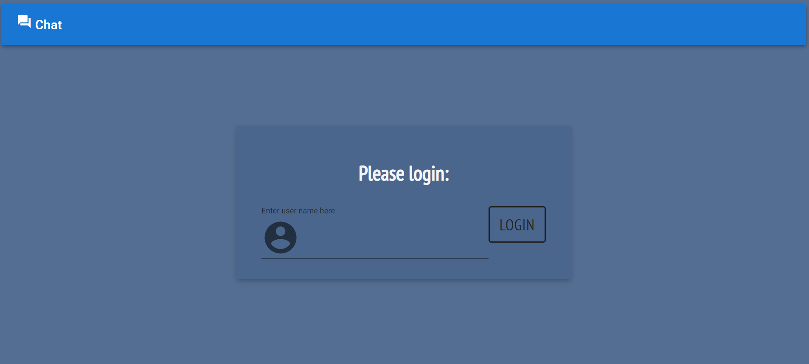
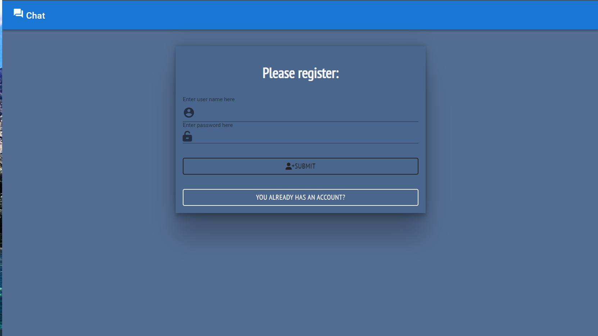
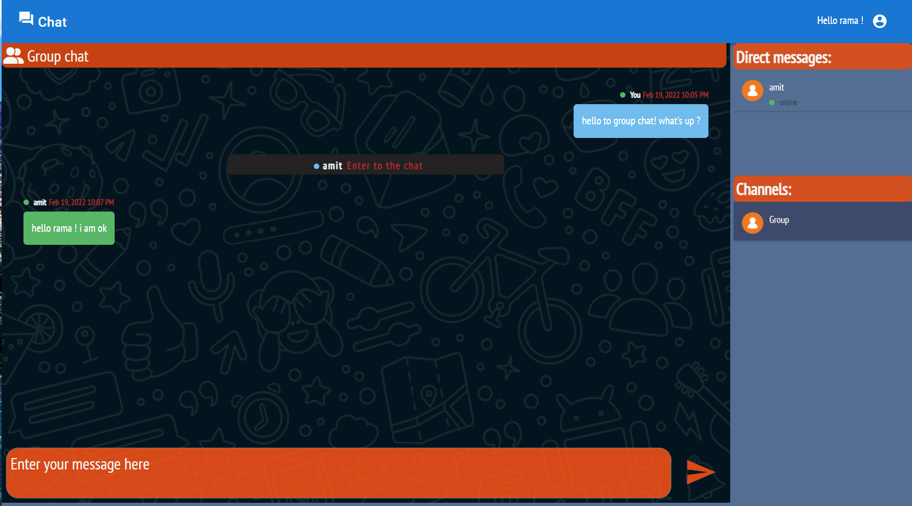

## Live chat app with Socket Io and docker 💬🐋

#### Assignment in the cyber4's course for practicing the socket.io library and docker

---

### Technologies in use - 👩‍💻👨‍💻

- **[React](https://reactjs.org/) - For the frontend**
- **[TypeScript](https://www.typescriptlang.org/) - As a programming language**
- **[React Router DOM](https://www.npmjs.com/package/react-router-dom) - To create single page app**
- **[Redux](https://redux.js.org/) - for state management**
- **[Docker](https://www.docker.com/) - For global use**
- **[Socket.io](https://socket.io/) - For live connection**

#### Packages 📦

##### Front-end

- **[Axios](https://www.npmjs.com/package/axios) - For API requests**
- **[Notyf](https://www.npmjs.com/package/notyf) - for nice popUp messages**
- **[Socket.io-client](https://socket.io/docs/v4/client-api/) - For client server connection**
- **[Moment](https://momentjs.com/) - For nice dates**
- **[mui](https://mui.com/) - For design**
- **[font awesome](https://fontawesome.com/icons/user?s=solid) - For icons**

##### Back-end

- **[ts-node-dev](https://www.npmjs.com/package/ts-node-dev) and [ts-node](https://www.npmjs.com/package/ts-node)**
- **[Express](https://www.npmjs.com/package/express)**
- **[Socket.io](https://socket.io/) - For client server connection**
- **[Cors](https://www.npmjs.com/package/cors)**
- **[JWT](https://jwt.io/) - To generate tokens**
- **[Bcrypt](https://www.npmjs.com/package/bcrypt) - To encrypt passwords**

---

## My app -

## Public use -

<!-- [Dockerhub-ramab2108/socket-chat](https://hub.docker.com/repository/docker/ramab2108/socket-chat) -->

#### Link to docker hub- ✨Not yet✨

#### Link to heroku- ✨Not yet✨

## Local use -

### Github 🐱‍👤

- **Clone this repo**
- **Run `npm i` on the `client` and `server` dirs - To install all the dependencies**
- **Run `npm run dev` on `server` dir - To start the server**
- **Run `npm start` on `client` dir - To start the front-end**
- **Go to http://localhost:3000 and enjoy!**

### Docker 🐋

- **Docker - Run on root dir `docker build -t chat-app .` ➡ `docker run -dp 4000:4000 chat-app`**
- **Docker compose - Run on root dir `docker-compose up -d --build`**
- **Go to http://localhost:4000 and enjoy!**

---

### Features - 💫

- **Login and register with a unique username and password** 👤
- **The online users view is updated live - online or offline indicator** 🔴🟢👥
- **User joined and left the chat group messages**🚪
- **Getting all your messages history**📅
- **Private messages to the user by clicking on the user** 🔏
- **Chat scrolls down automatically** 🔽
- **Indication for the user typing live** 💬
- **Showing the selected conversation messages**👥
- **Unread messages notifications**🔴1️⃣
- **Indication that a user is logging in or out of the chat** 👤❌✔
- **Navbar with the option to disconnect from the chat** 🚪
- **Sending messages also to disconnected users**⛔
- **Nice design!** 💅

---

## Future Plans 📅👩‍🚀

#### Front:

- **Search - Search messages and users 🔎**
- **Adding custom group chats 👥**
- **Using the tokens to auth when sending messages** 🚫
- **Go to last unread message page position when entering to conversation** ↕
- **Mobile design** 📱
- **Sending the typing signal just to the current room** 💬

#### Back:

- **Adding custom group chats 👥**
- **Save data in MongoDB**
- **Better error handling**

#### General:

- **Cleaning logs and code in general 🧹🧼**
- **Tests - front and back 💯**
- **Upload docker image to docker-hub 🐳**
- **Deployment to heroku 🌎**
- **Github workflows 🐱‍💻**

---

## Screenshots 📸 -

### Login and register 🔐

### 

### 

### Group chat 👩‍🦰🧑👨‍🦱

### 

### Typing in a private room 🤫

### 

### Offline users and notification sign 🔴

### 

---
