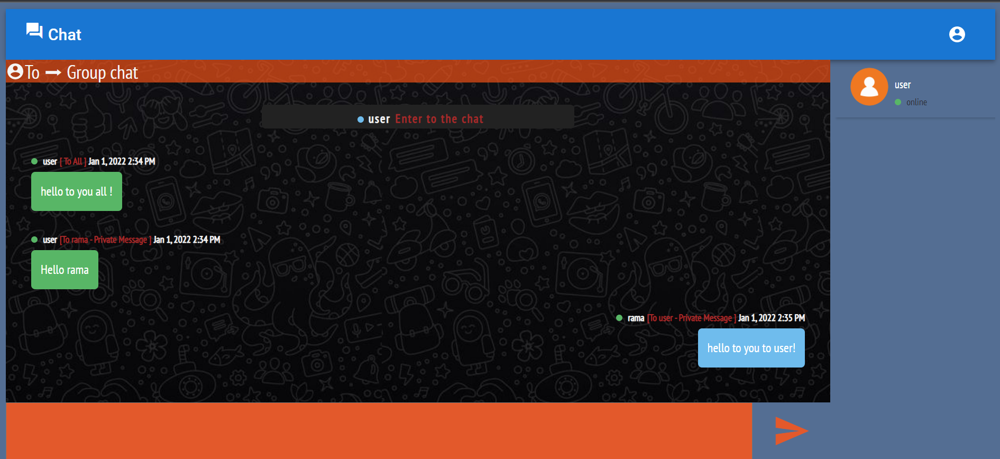

## Live chat app with Socket Io and docker 💬🐋

#### Assignment in the cyber4's course for practicing the socket.io library and docker

---

### Technologies in use - 👩‍💻👨‍💻

- **[React](https://reactjs.org/)**
- **[TypeScript](https://www.typescriptlang.org/)**
- **[React Router DOM](https://www.npmjs.com/package/react-router-dom)**
- **[Redux](https://redux.js.org/)**
- **[Docker](https://www.docker.com/)**

#### Packages

##### Front-end

- **[Axios](https://www.npmjs.com/package/axios) - For API requests**
- **[Notyf](https://www.npmjs.com/package/notyf) - for nice popUp messages**
- **[Socket.io-client](https://socket.io/docs/v4/client-api/) - For client server connection**
- **[Moment](https://momentjs.com/) - For nice dates**
- **[mui](https://mui.com/) - For design**

##### Back-end

- **[ts-node](https://www.npmjs.com/package/ts-node-dev) and [ts-node](https://www.npmjs.com/package/ts-node)**
- **[Express](https://www.npmjs.com/package/express)**
- **[Socket.io](https://socket.io/) - For client server connection**
- **[Cors](https://www.npmjs.com/package/cors)**

---

## My app -

## Public use -

#### Visit my app on heroku- ✨**TODO -(Add link)**✨

#### DockerHub - ✨**TODO -(Add link)**✨

## Local use -

### Github 🐱‍👤

- **Clone this repo**
- **Run `npm i` on the `client` and `server` dirs - To install all the dependencies**
- **Run `npm run dev` on `server` dir - To start the server**
- **Run `npm start` on `client` dir - To start the front-end**
- **Go to http://localhost:3000 and enjoy!**

### Docker 🐋

- **Run on root dir `docker-compose up -d --build`**
- **Go to http://localhost:3000 and enjoy!**

- **TODO -(Add instructions)**

---

### Features - 💫

- **Login with a unique username** 👤
- **The online users view is updated live** 👥
- **Private messages to the user by clicking on the user** 🔏
- **Chat scrolls down automatically** 🔽
- **Indication for the user typing live** 💬
- **Indication that a user is logging in or out of the chat** 👤❌✔
- **Navbar with the option to disconnect from the chat** 🚪
- **Nice design!** 💅

---

## Screenshots 📸 -

### 

### 

### 

---
